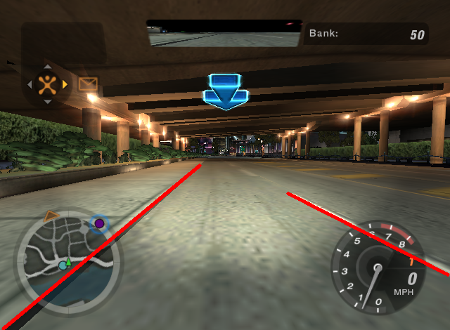
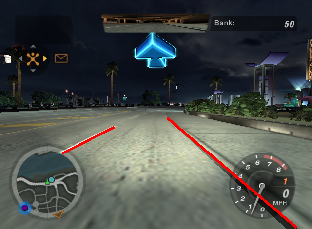
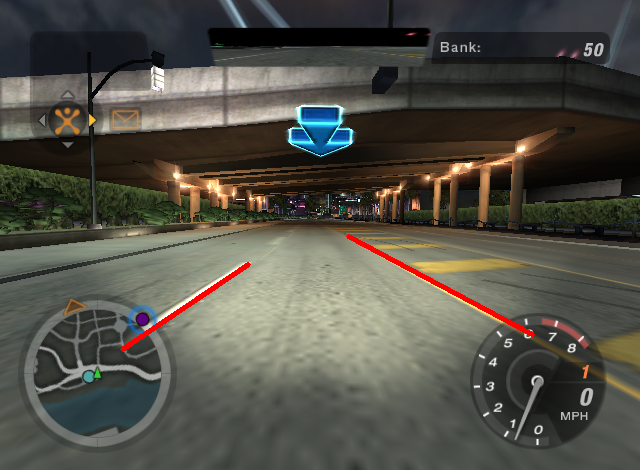
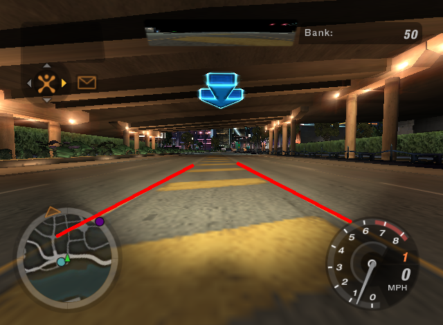
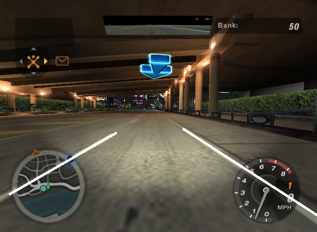
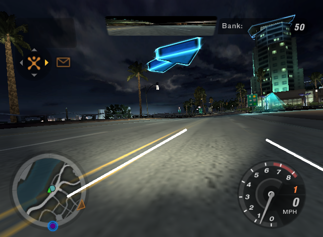
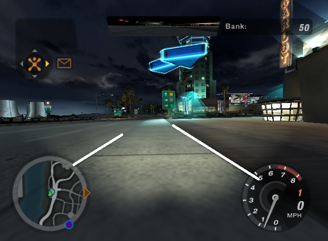
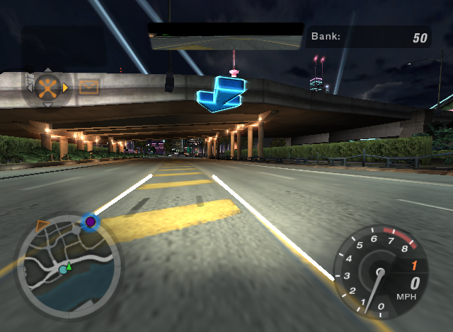

# Detecting Lanes in NFS UNderground 2

In this project we detect lanes in one of the popular racing games, __NFS Underground 2__. We used image various precessing techniques to detect lanes frame by frame from the image stream captured from the game. All the processing is done in real time, i.e. the lanes are detected simultaneously as the game is played.

## Results
Some results are shown below :

  
  

  
  

  
  

  
  

